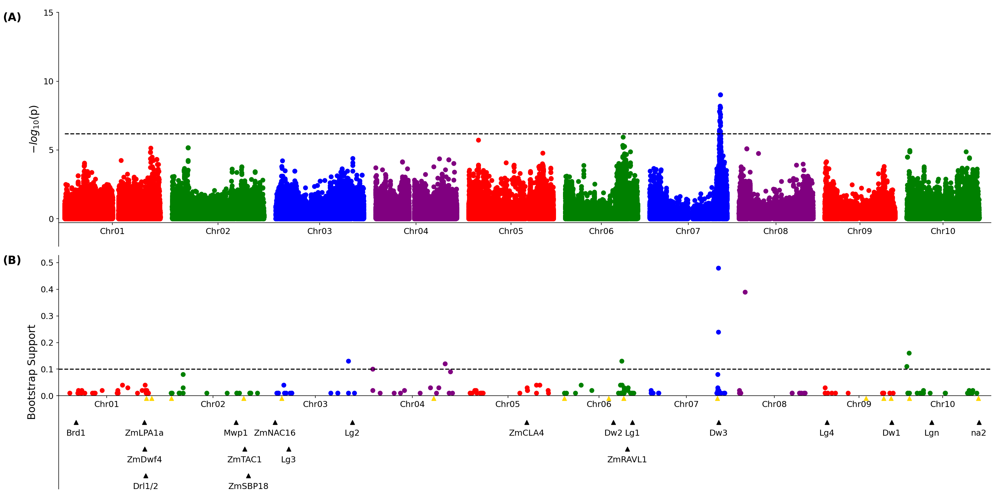
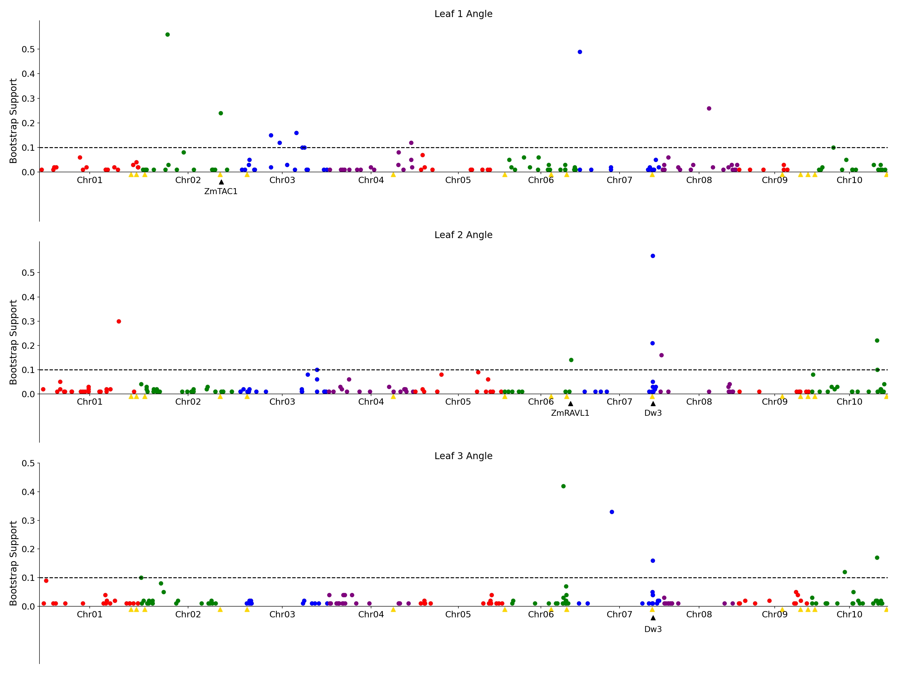

# Results and visualization for GWAS of leaf angles derived from 3D-Reconstruction of Sorghum

Implemented in the paper:

  * 3D reconstruction identifies loci linked to variation in angle of individual sorghum leaves. [doi:10.7717/peerj.12628](https://peerj.com/articles/12628/)
 

 

